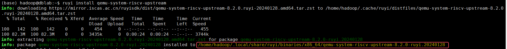
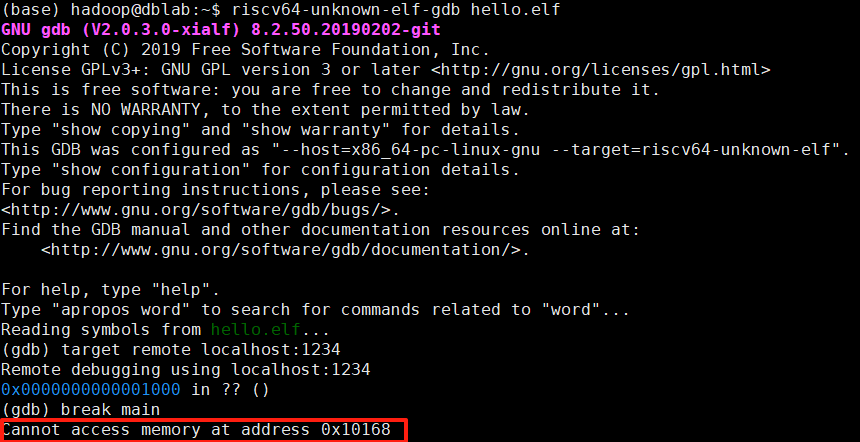

# GDB QEMU riscv64 Debugging

使用 **QEMU 模拟器** 启动 RISC-V 目标（`-machine virt`）
通过 **GDB 远程协议 (`target remote`)** 连接到 QEMU 的 GDB server
架构是 **riscv64**

### 一、环境准备

#### 1.安装必要组件（RuyiSDK）

如果你已经通过 **`ruyi install llvm-upstream gnu-plct qemu-user-riscv-upstream`** 安装过，那么你的系统里应该已经有 **QEMU（RISC-V 用户模式）**，但它是 **用户态模拟（qemu-user）**，不能直接用来启动完整系统或者 GDB 调试硬件寄存器环境。

如果要 **GDB 调试**（IDE 连接），就必须用 **`qemu-system-riscv64`**，而不是 `qemu-riscv64`。

如未安装系统级 QEMU，补装：

```bash
ruyi install qemu-system-riscv-upstream
```



可以看到安装位置

#### 2.确认工具链安装路径

使用如下命令确认 `QEMU` 与 `GDB` 的路径：

```bash
# 查看 qemu-system-riscv64 路径
/home/hadoop/.local/share/ruyi/binaries/x86_64/qemu-system-riscv-upstream-*/bin/qemu-system-riscv64 --version

# 查找 riscv64 工具链
find ~/.local/share/ruyi/binaries -name "riscv64-unknown-elf-gdb"
```

添加到 PATH：

```bash
# 临时生效
export PATH=/home/hadoop/.local/share/ruyi/binaries/x86_64/gnu-milkv-milkv-duo-elf-bin-0.20240731.0+git.67688c7335e7/bin/:$PATH

# 永久生效
$ echo 'export PATH=/home/hadoop/.local/share/ruyi/binaries/x86_64/gnu-milkv-milkv-duo-elf-bin-0.20240731.0+git.67688c7335e7/bin/:$PATH' >> ~/.bashrc
$ source ~/.bashrc
```

#### 3.验证安装结果

```bash
riscv64-unknown-elf-gcc --version
#输出类似 riscv64-unknown-elf-gcc (V2.0.3.0-xialf) 10.2.0

riscv64-unknown-elf-gdb --version
#输出类似 GNU gdb (V2.0.3.0-xialf) 8.2.50.20190202-git
```

ps:可能会遇到缺少.so库，安装对应的QEMU包就可以

RuyiSDK 安装的 `gnu-plct` 包应该已经包含 `riscv64-unknown-elf-gcc` 和 `riscv64-unknown-elf-gdb`。确认一下：

`riscv64-unknown-elf-gcc --version`
`riscv64-unknown-elf-gdb --version`

如若未安装，直接安装 `gnu-plct`，通过 `ruyi install gnu-plct`或者

```bash
sudo apt install gcc-riscv64-unknown-elf
#第二个是通过ruyisdk中的工具链下载
```

### 二、编写与编译 RISC-V 程序

#### 1.编写并编译测试程序

创建`hello.c`：

```c
int main() {
    int i = 0;
    while (1) {
        i++;
    }
    return 0;
}
```

编译为 RISC-V ELF 文件：

```
riscv64-unknown-elf-gcc -g -o hello.elf hello.c
```

确认生成：

```
file hello.elf
```

输出应该类似：

```
hello.elf: ELF 64-bit LSB executable, UCB RISC-V
```

#### 2.启动 QEMU + GDB Server

使用 `qemu-system-riscv64` 启动模拟器并监听 GDB：

运行：

```bash
/home/hadoop/.local/share/ruyi/binaries/x86_64/qemu-system-riscv-upstream-8.2.0-ruyi.20240128/bin/qemu-system-riscv64 \
  -machine virt \
  -nographic \
  -kernel SumDemo1 \
  -S -gdb tcp::1234
```

此时终端会挂起，表示 QEMU 等待 GDB 连接。

#### 3.启动 GDB 并连接 QEMU

在**新终端**执行：

```bash
riscv64-unknown-elf-gdb hello.elf
```

执行后显示：

```
$ riscv64-unknown-elf-gdb hello.elf
GNU gdb (V2.0.3.0-xialf) 8.2.50.20190202-git
Copyright (C) 2019 Free Software Foundation, Inc.
License GPLv3+: GNU GPL version 3 or later <http://gnu.org/licenses/gpl.html>
This is free software: you are free to change and redistribute it.
There is NO WARRANTY, to the extent permitted by law.
Type "show copying" and "show warranty" for details.
This GDB was configured as "--host=x86_64-pc-linux-gnu --target=riscv64-unknown-elf".
Type "show configuration" for configuration details.
For bug reporting instructions, please see:
<http://www.gnu.org/software/gdb/bugs/>.
Find the GDB manual and other documentation resources online at:
    <http://www.gnu.org/software/gdb/documentation/>.

For help, type "help".
Type "apropos word" to search for commands related to "word"...
Reading symbols from hello.elf...
(No debugging symbols found in hello.elf)
(gdb) 
```

进入 GDB 后执行：

```
target remote localhost:1234
```

然后可以设置断点和调试：

```bash
(gdb) break main        # 设置断点
(gdb) continue          # 开始执行到断点,程序会运行并停在 main
(gdb) next              # 单步执行（不进入函数）
(gdb) step              # 单步执行（进入函数）
```

#### 命令解释：

| 指令                           | 含义                   | 说明                                    |
| ------------------------------ | ---------------------- | --------------------------------------- |
| `file hello.elf`               | 加载符号文件           | 让 GDB 知道程序符号                     |
| `target remote localhost:1234` | 连接 QEMU GDB server   | 必须在 QEMU 用 `-S -gdb tcp::1234` 启动 |
| `load`                         | 把 ELF 加载到目标内存  | 用于裸机调试，不依赖 QEMU `-kernel`     |
| `break main`                   | 在 main 函数打断点     | 可以用 `break 行号`                     |
| `continue` (`c`)               | 运行到下一个断点       | 程序开始执行                            |
| `next` (`n`)                   | 单步执行（跳过函数）   | 需要程序在断点处                        |
| `step` (`s`)                   | 单步执行（进入函数）   | 和 `next` 类似，但会进入函数体          |
| `info registers`               | 查看寄存器             | 调试 CPU 状态                           |
| `x/10i $pc`                    | 查看当前 PC 附近的指令 | 反汇编                                  |
| `print 变量名`                 | 打印变量值             | 需要带 `-g` 编译                        |
| `quit`                         | 退出 GDB               | 结束调试                                |

### 遇到的问题：

1.break main 遇到 `Cannot access memory at address 0x10168`



解决：

```
file hello.elf              # 加载符号
target remote localhost:1234
b main                      # 可能会提示不可访问，忽略
c                           # 让程序跑起来，进入 main
```

第一次打断点失败没关系，也可以：

```
target remote localhost:1234
monitor reset halt          # 让 QEMU 重置并停住
load                        # 把 ELF 再加载进 QEMU
b main
c
```

这样 QEMU 内存和符号是完全同步的。
