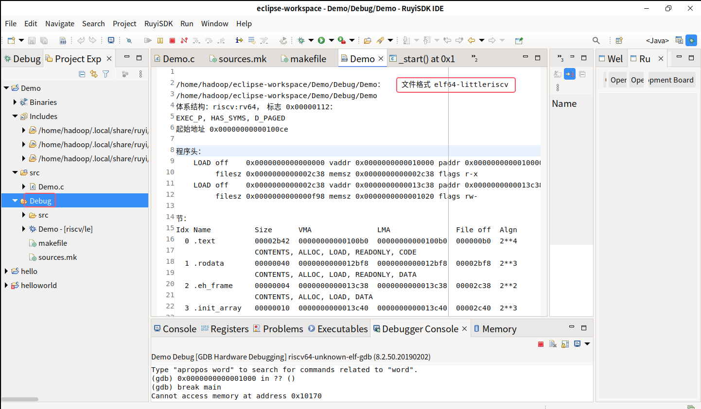
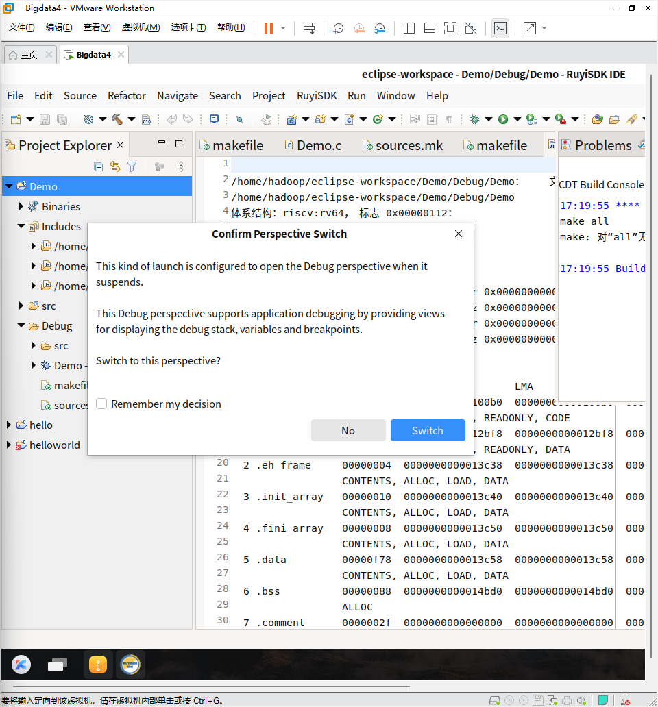
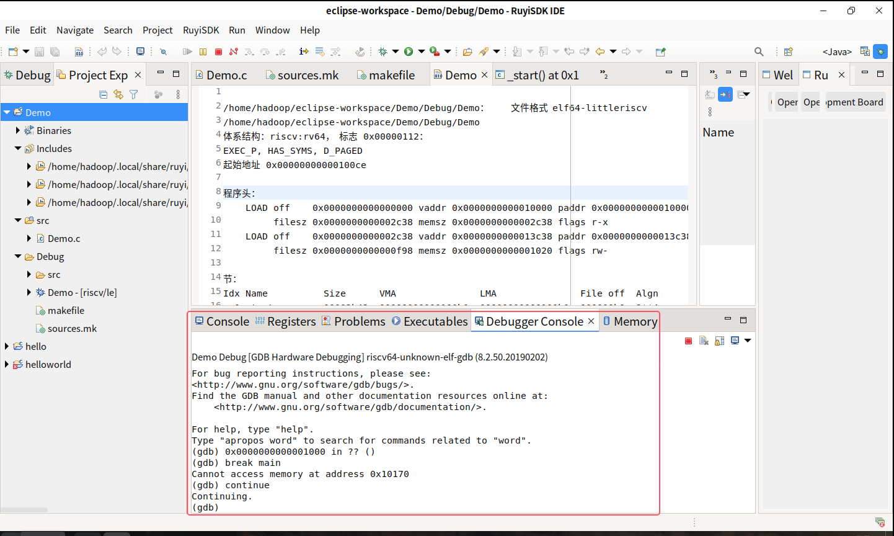

# IDE中使用GDB QEMU riscv64 Debugging

## 一、准备工作

下载好工具链准备工具链 `riscv64-unknown-elf-gcc` + `riscv64-unknown-elf-gdb`

**安装 QEMU**

- 确认：

  ```
  qemu-system-riscv64 --version
  qemu-riscv64 --version
  ```

## 二、Eclipse 工程配置

### 准备 C 程序

在 Eclipse 中编写一个简单的 **Hello World C 程序**

如：

```c
#include <stdio.h>

int main() {
    printf("Hello, RISC-V Debug!\n");
    while (1);  // 保持程序运行，方便 GDB 附加
    return 0;
}
```

接着编译成RISC-V ELF文件，如何生成RISC-V ELF 文件呢？

**步骤：**

1. 在 Eclipse 工程里点 **Project → Build Project**，此时会调用交叉编译器，生成.elf/Demo,可以观察文件里面的内容，如图



文件中显示该文件的格式：`elf64-littleriscv`

**ps:**

标准的ELF可执行文件格式字段包括 **程序头 (Program Headers)** 和 **节区 (Sections)**：

- `.text`（代码段）
- `.rodata`（只读数据）
- `.data`（已初始化数据）
- `.bss`（未初始化数据）
- `.init_array`、`.fini_array`（C 运行时初始化/析构数组）
- `.eh_frame`（异常处理/栈回溯用）

2. 验证。在终端运行 `file Demo` ，会成功显示 

   ```bash
   Demo: ELF 64-bit LSB executable, UCB RISC-V, RVC, double-float ABI, version 1 (SYSV), statically linked, with debug_info, not stripped
   ```

### 配置GDB QEMU riscv64 Debugging：

1. 在工程里编译生成 `.elf`。

2. 终端启动 QEMU：

   ```
   qemu-system-riscv64 -machine virt -nographic -kernel Sum -S -gdb tcp::1234
   ```

   - `-S` → 开机暂停，等待调试器。
   - `-gdb tcp::1234` → 开启 GDB 远程调试端口。

3. Eclipse 中配置调试：

   - 打开 **Run → Debug Configurations…**
   - 选择 **GDB QEMU riscv64 Debugging** → New Configuration
   - 配置：
     - **C/C++ Application**: 指向 `.elf或者Demo`
     - **Debugger** → GDB 命令：`riscv64-unknown-elf-gdb`
     - **Debugger → Connection** → Type: `Generic TCP/IP`，Protocol: `remote`，Host: `localhost`，Port: `1234`
   - 点击 **Apply → Debug**。

   

   出现这个确认后，选择`Switch`

   Eclipse 会启动 GDB，连接 QEMU，就能下断点、单步、查看寄存器。如图：
   

出现这个就可以进行调试了！