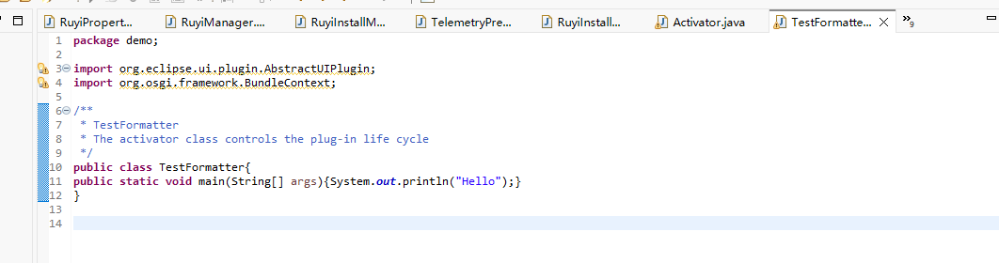
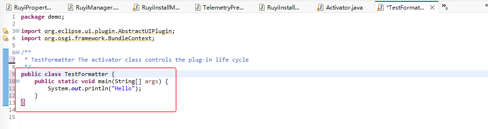
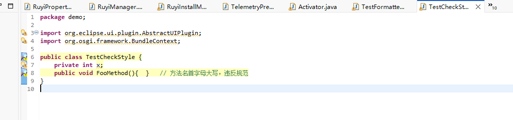
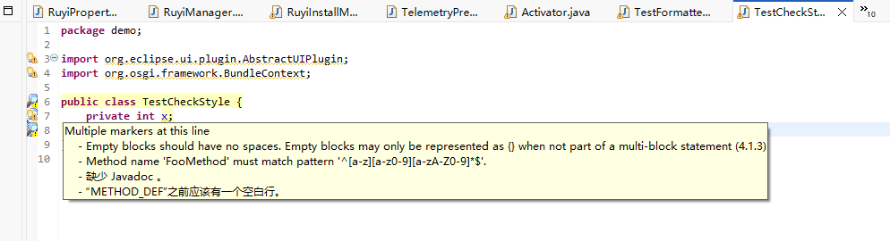
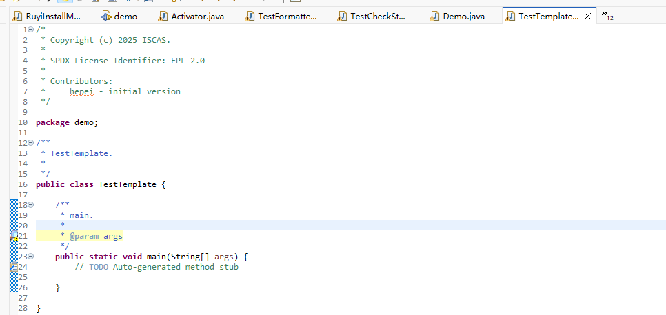

# 配置并验证 RuyiSDK 代码风格

### 具体验证：

**适用 IDE**：Eclipse

#### 1.导入Formatter配置

1. 下载 [`ruyisdk-eclipse-java-google-style.xml`](https://github.com/ruyisdk/ruyisdk-eclipse-plugins/blob/main/docs/developer/coding-guidelines/ruyisdk-eclipse-java-google-style.xml) 文件。
2. 在 IDE 中导入该文件作为代码格式化模板：

- Eclipse
  - 进入 `Window` → `Preferences` → `Java` → `Code Style` → `Formatter`。
  - 点击 `Import` 并选择该文件。

先随便写一些不符合规则的代码，如：

通过在文件中点击右键 → `Source` → `Format`（或者直接按快捷键 `Ctrl+Shift+F`）

观察是否格式化为调整过的风格（例如：类和方法的大括号会换行，缩进 4 个空格，而不是 2 个空格）。

如果格式自动调整成 导入的 Style（比如 `public class Test {` 换行了，缩进正确），说明 **Formatter 配置生效**。

格式调整后：

#### 2.导入 Checkstyle 配置

1. 下载 [`ruyisdk_ide_google_checks.xml`](https://github.com/ruyisdk/ruyisdk-eclipse-plugins/blob/main/docs/developer/coding-guidelines/ruyisdk_ide_google_checks.xml) 文件。
2. 在 IDE 中启用  Checkstyle  检查：
   - Eclipse
     - 安装 `Checkstyle` 插件。
     - 在 `Window` → `Preferences` → `Checkstyle` 中导入配置文件。

违反 checkstyle 的代码:

在项目里开启 Checkstyle

- 在项目上右键 → `Checkstyle` → `Activate Checkstyle`。
- 这样 Eclipse 会开始检查这个项目里的所有 Java 文件。
- 保存文件，看左边行号的黄色小叹号 ，出现提示，说明 **Checkstyle 配置生效**

#### 3.导入Code Templates配置

1. 下载 [`ruyisdk-eclipse-java-codetemplates.xml`](https://github.com/ruyisdk/ruyisdk-eclipse-plugins/blob/main/docs/developer/coding-guidelines/ruyisdk-eclipse-java-codetemplates.xml) 文件。
2. 在 IDE 中导入该文件作为代码格式化模板：
   - Eclipse
     - 进入 `Window` → `Preferences` → `Java` → `Code Style` → `Code Templates`。
     - 点击 `Import` 并选择该文件。

通过新建类（File ->New -> Class -> Demo）,勾选模板，就会生成模式化的模板

例如：

**Eclipse 确认生效！**